# Building a Serverless Customer Service Bot

## Overview

Bots are eating the world! Wild Rydes (www.wildrydes.com), a new startup that is building the world’s leading mobile/VR/AR unicorn transportation system, has decided to use serverless chatbots to staff its customer service department. As it scales to millions of users, Wild Rydes needed a scalable way to meet the customer service needs of its customers instead of relying on human customer service agents. Wild Rydes needs your help to implement its vision.

In this workshop, you will help Wild Rydes launch the future of customer service. You will build a customer service bot for Facebook that runs on AWS Lambda and Amazon API Gateway. You’ll enable the bot to respond intelligently to customers by building in Natural Language Processing (NLP). The bot will use an event-driven architecture in which Lambda functions trigger workflows that pull customer responses from a Knowledge Base of Q&A. You’ll also write a function to trigger a manual approval request to a Slack channel, so that Wild Rydes’ technical staff can approve or reject messages from the bot to the customer. Finally, you’ll also learn to use Amazon DynamoDB and Amazon Elasticsearch Service to log all incoming requests and create live analytical dashboards, such as for sentiment analysis, to track customer satisfaction.


### Sections
Each of the sections in this workshop build the necessary components for the Customer Service Chatbot.

* **Section 1: Facebook Page Integration**  

    This section uses [Facebook](https://www.facebook.com) to create a Faceook page and a Facebook app. The Facebook will allow us to use an outgoing webhook to communicate with our customers via Facebook Messenger and the Page Feed. This outgoing webhook will be tied to our Chatbot.

* **Section 2: Slack Integration**  

    This section integrates the popular messaging app, [Slack](https://www.slack.com), into the chatbot application so that our operational team can approve and reject answers and get live stats via channel commands.

* **Section 3: Knowledge Base**  

    This section adds an Elasticsearch cluster to the application which is used to index our knowledge base as well as our sentiment analysis index of all the incoming messages.

* **Section 4: Language Processing Lambda Function**  

    This section focuses on using Amazon DynamoDB Streams and AWS Lambda to build the glue between our Chat bot platform integrations, our knowledge base and our live dashboard.

* **Section 5: Real-Time Dashboard (Sentiment Analysis)**

    This final section will take us through building a live sentiment analysis dashboard with the help of [Kibana](https://www.elastic.co/products/kibana) and Elasticsearch.

## Setup Environment

To get started with this workshop, you need to launch a CloudFormation template which will setup your entire environment to work off. This template will use the [AWS Serverless Application Model](https://github.com/awslabs/serverless-application-model/blob/master/versions/2016-10-31.md) to setup the basic webhooks and Lambda functions. The [AWS Serverless Application Model](https://github.com/awslabs/serverless-application-model/blob/master/versions/2016-10-31.md) (AWS SAM) extends AWS CloudFormation to provide a simplified way of defining the Amazon API Gateway APIs, AWS Lambda functions, and Amazon DynamoDB tables needed by this serverless application.

**Setup Basic Environment with CloudFormation and AWS SAM**

1\. Launch the CloudFormation stack that creates the basic setup by clicking on **Deploy to AWS** below.

Region | Launch Template
------------ | -------------
**N. Virginia** (us-east-1) | [](https://console.aws.amazon.com/cloudformation/home?region=us-east-1#/stacks/new?stackName=chatbot&templateURL=https://s3.amazonaws.com/serverless-chatbot-code/chatbot.yaml)
**Oregon** (us-west-2) | [](https://console.aws.amazon.com/cloudformation/home?region=us-west-2#/stacks/new?stackName=chatbot&templateURL=https://s3.amazonaws.com/serverless-chatbot-code-us-west-2/chatbot-us-west-2.yaml)

2\. This will launch the CloudFormation console and it should automatically load in the relevant CloudFormation & SAM YAML file. Click **Next**

3\. Provide your stack a name - we prepopulated this with **chatbot**. We suggest you leave the default, unless you would have any conflicting CloudFormation stack in your account. Click on **Next**

4\. In this step you can define additional options, such as specifying Tags for your Stack or to launch it with a specific IAM role. We suggest that you leave the default settings and click on **Next**

5\. This will allow you to review the stack before launching it. **IMPORTANT**: Scroll down and check the boxes of `I acknowledge that AWS CloudFormation might create IAM resources.` and `I acknowledge that AWS CloudFormation might create IAM resources with custom names.`. Our stack will create a few IAM roles for AWS Lambda to use, this is just to acknowledge that new roles will be created.

6\. Click on the **Create Change Set** button below and wait until you see the transformation output, which looks like this:

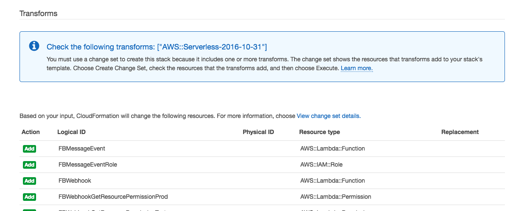

_Note: This transformation is part of the AWS Serverless Application Model to map the SAM YAML template into an actual CloudFormation template._

7\. If everything is fine, click on the **Execute** button. You should now see that your stack is being created:

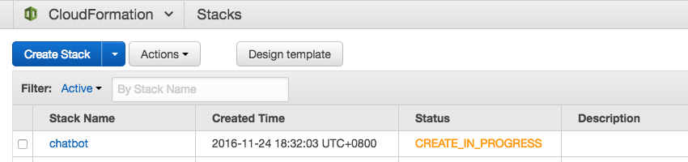

You can now proceed to setup your Elasticsearch cluster as specified below without waiting for the stack creation to finish. Just make sure that the stack has been successfully launched before proceeding to the later Section 1.

**Setup Elasticsearch Index**

For this workshop we will use Elasticsearch to build a knowledge base and store analytical information. Amazon's Elasticsearch Service is a managed service that makes it easy to deploy, operate, and scale Elasticsearch in the AWS Cloud. Since it takes roughly 10 minutes to launch an Elasticsearch cluster, we excluded the Elasticsearch cluster from the Cloudformation template to get you started quickly, even though the cluster isn't ready yet. Please follow the next steps to start the deployment of your Elasticsearch domain (do not wait for the Elasticsearch cluster to complete, and immediately proceed to Section 1 after launching it):

1\. Navigate to your AWS console and click on **Elasticsearch Service** under Analytics.

2\. Click on **Create a new domain**

3\. Enter `chatbot` as **Elasticsearch domain name**. Select Elasticsearch version **2.3** and click **Next**.

4\. In this step we will configure our Elasticsearch cluster. Keep the Instance count on **1**, but change the **Instance type** to **t2.micro.elasticsearch** and leave both checkboxes below unticked. For the **Storage type** choose **EBS** and leave the default parameters of **General Purpose (SSD)** and **10GB**. Click next.

5\. Now we need to specify an access policy for our Elasticsearch cluster. We want to provide world-readable access to our dashboard, but lock down the adding, editing and deleting of data within the cluster. Hence, please use the below policy (**Important:** Change all the `<AWS-REGION>` and `<AWS-ACCOUNT>` references below with your  AWS region and AWS account ID that you are using - AWS Regions must be defined with the [Region API Code](http://docs.aws.amazon.com/AWSEC2/latest/UserGuide/using-regions-availability-zones.html#concepts-available-regions) and your AWS Account ID can be found in [My Account](https://console.aws.amazon.com/billing/home?#/account) in your console):

```json
{
  "Version": "2012-10-17",
  "Statement": [
    {
      "Sid": "",
      "Effect": "Allow",
      "Principal": {
        "AWS": "*"
      },
      "Action": [
        "es:ESHttpGet",
        "es:ESHttpHead"
      ],
      "Resource": "arn:aws:es:<AWS-REGION>:<AWS-ACCOUNT>:domain/chatbot/*"
    },
    {
      "Sid": "",
      "Effect": "Allow",
      "Principal": {
        "AWS": "*"
      },
      "Action": "es:ESHttpP*",
      "Resource": [
        "arn:aws:es:<AWS-REGION>:<AWS-ACCOUNT>:domain/chatbot/.kibana-4*",
        "arn:aws:es:<AWS-REGION>:<AWS-ACCOUNT>:domain/chatbot/messages/_msearch*",
        "arn:aws:es:<AWS-REGION>:<AWS-ACCOUNT>:domain/chatbot/messages/_search*"
      ]
    },
    {
      "Effect": "Allow",
      "Principal": {
        "AWS": "arn:aws:iam::<AWS-ACCOUNT>:root"
      },
      "Action": "es:*",
      "Resource": "arn:aws:es:<AWS-REGION>:<AWS-ACCOUNT>:domain/chatbot/*"
    }
  ]
}
```

6\. Click next to review all your parameters. If everything is fine, click on **Confirm and create**. Your Elasticsearch cluster will now launch. This procedure will take roughly 10 minutes, so we suggest to proceed to Section 1 whilst your Elasticsearch cluster will get ready in the background.


## Section 1 - Facebook Page Integration

**What you'll do in this section...**

In this section we will create a new Page on Facebook, create a Facebook App through Facebook's developer portal and tie it to the page and it's Messenger functionality. This allows the app to be notified upon updates on the Facebook page or incoming chat messages. We will then create a webhook in the Facebook app, that will call our AWS Lambda function via the Amazon API Gateway upon incoming posts or messages. Incoming messages will be stored in an Amazon DynamoDB table.

**Architecture**


1\. Open your Facebook account and navigate to Facebook Pages and [**Create a Page**](https://www.facebook.com/pages/create/).

2\. Choose the type of Page you want to create. For this example we will choose a **Cause or Community** page and provide it a name, such as for example WildRydes Chatbot Workshop of \<Your Name\>

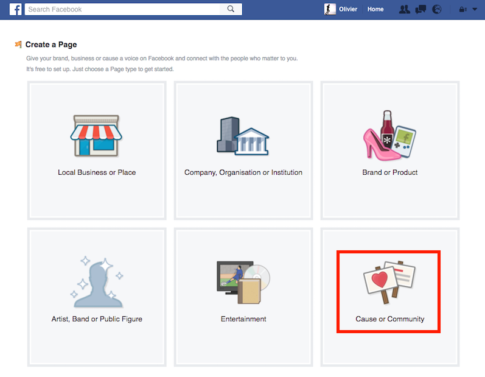

3\. Proceed to setup the Facebook page. These steps are optional, and you can safely hit the **Skip** button until the Facebook page is created.

4\. Navigate to the [Facebook Developer Portal](https://developers.facebook.com/) and click on the right-hand drop-down box **My Apps** and select **Add a New App**

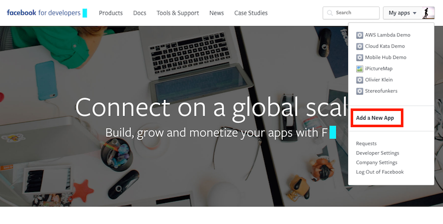

5\. Provide your application a name and provide a working e-mail address. In the Category Dropdown choose **Apps for Pages**

6\. Facebook will now redirect you to your App Settings page. Click on the left hand side navigation bar on **Add Product**

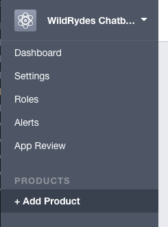

7\. Now click on the **Get Started** button of **Webhooks**

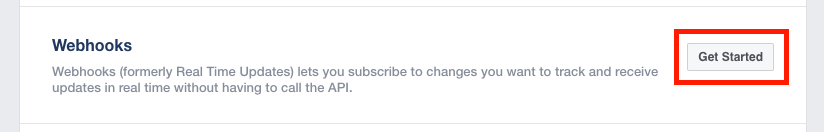

8\. We now want to subscribe our AWS Lambda function to this Facebook app. Click on **New Subcription** and select **Page**

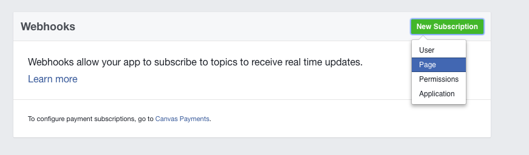

9\. In the popup dialog enter your API Gateway URL to the `facebook-page-webhook` webhook into the **Callback URL** textbox. A sample URL would be  `https://<domain-id>.execute-api.<your-region>.amazonaws.com/Prod/facebook-page-webhook`. For the **Verify token** enter **reinvent-workshop** as value. (_Note: To simplify this workshop, we hardcoded the verify token into the AWS Lambda code. If you would deploy a production app, make sure to change the verify token to a value only known to you and update the `authenticateFacebookWebhook` function accordingly in the **chatbot-FBWebhook-\<Random ID\>** AWS Lambda function)_) For the **Subscription fields** tick the **feed** and **messages** checkboxes, this will allow us to be notified via webhook upon any new message or feed post.

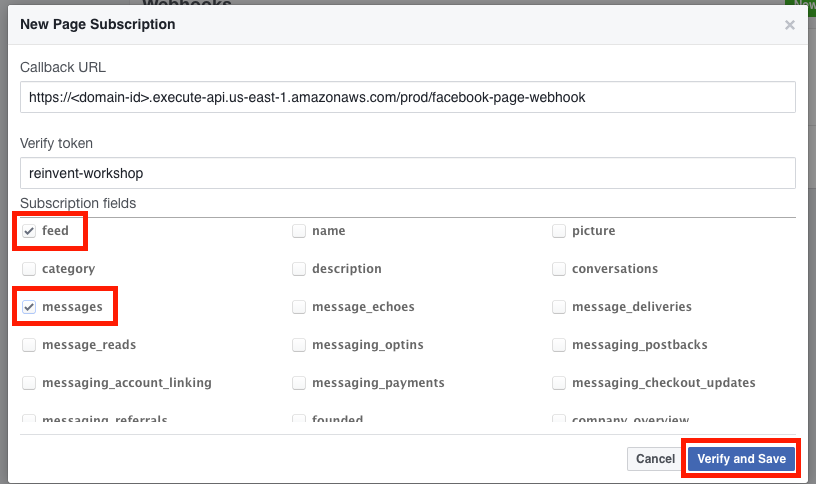

_Note: To find your API Gateway stage URL, go to the **AWS Management Console**, navigate to the **Amazon API Gateway Service** and click on **chatbot**. Select **Stages** and click on **Prod** in the Stage selection legend. You will now see the URL on the right side:_

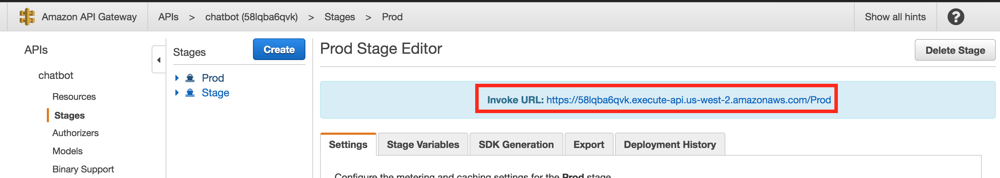

10\. We now added a webhook, but we still lack the Messenger integration. Click on **Add Product** on your left menu and click on the **Get Started** button of **Messenger** on the next page.

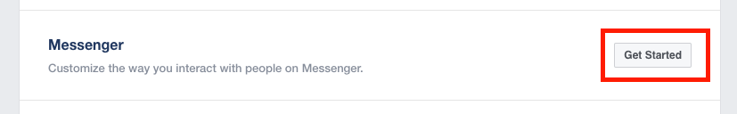

11\. Before we can associate our webhook with the Facebook page messenger, we must provide our Facebook app access to your Facebook page. Scroll down to **Token Generation** and select your previously created Facebook page (e.g. WildRydes Chatbot Workshop of Your Name). This will trigger an OAuth process for your page. Click on the **Continue as Your Name** button and ignore the message that states that "Some of the permissions [..] have not been approved" (_This warning is due to our app not being verified by the Facebook team. To use Messenger capabilities, an app needs to verified first. For this workshop we don't intend to publish this app, so we can safely skip this step - on a real production page you must go through the verification process, otherwise your chatbot will only respond to your developer team_)

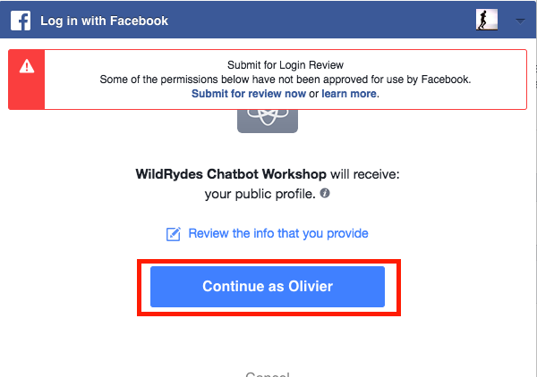

12\. Click **OK** on the next page to allow the access of your app to the Page. **IMPORTANT**: This will generate a Facebook **Page Access Token** - make sure to copy this token for later, click on it to copy it to your clipboard.

13\. This Page Access Token is a permanent access token (there are also other temporary token options which would be the preferred method for production apps). Let's verify if the generated token actually works and has no expiration date. To do this navigate to the [Facebook Access Token Debugger](https://developers.facebook.com/tools/debug/access_token) and paste your Page Access Token into the textfield and click **Debug**. You should now see your application with which this token is associated, the privileges we have (pages_messaging) and most importantly that it's valid and doesn't expire.

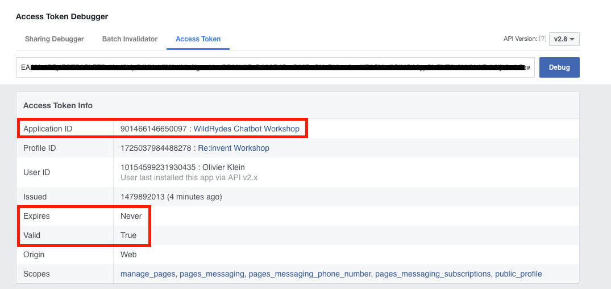

14\. We need to provide this page access token to our AWS Lambda function. Open a new tab and navigate to the **AWS Management Console** and select your **AWS Lambda** service. Select the **chatbot-FBWebhook-\<Random ID\>** function. Scroll down to see the **Environment variables**. Fill in the `FACEBOOK_ACCESS_TOKEN` with the access token value and the `FACEBOOK_PAGE_ID` with the Facebook Page ID of the page you previously created. Scroll up and hit the **Save** button.

_If you don't have the Facebook page ID handy, navigate to your Facebook page, click on **About** and scroll down to the bottom to see Facebook Page ID_

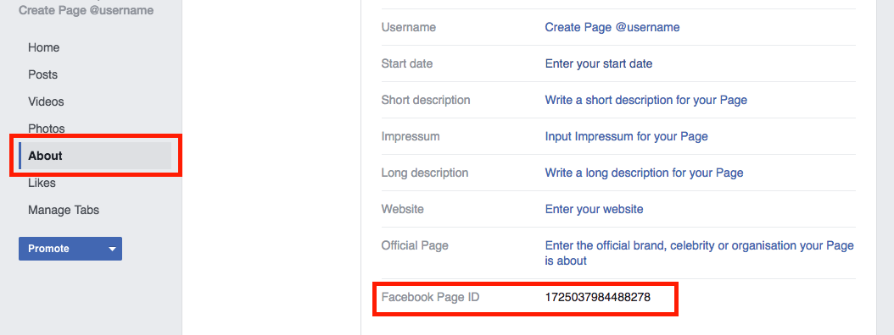

15\. Repeat this same procedure for the other Facebook Lambda function we will use later. Navigate to your **AWS Lambda** console and select the **chatbot-FBMessageEvent-\<Random ID\>** function. Scroll down to see the **Environment variables**. Fill in the `FACEBOOK_ACCESS_TOKEN` with the access token value and the `FACEBOOK_PAGE_ID` with the Facebook Page ID of the page you previously created. Scroll up and hit the **Save** button.


###### Section 1 Complete!
That's it! We created our first Facebook application and connected it with our AWS Lambda function. Our AWS Lambda function will now receive updates on incoming Messenger messages and stores them in DynamoDB.

Let's try this out by navigating to our newly created Facebook page. Now click on **Message** to start messaging with the page. This will open up the Messenger tab. Write a message inside, such as "Hello Chatbot". (Note: As we have not created our knowledge base yet, the Chatbot function will not yet reply, this will only be done in
Section 4)

Now navigate to the **AWS Management Console** and select your **Amazon DynamoDB** service. Click on **Tables** and open the **facebook-messages** table. In the right tab click on **Items** and we should now see the incoming chat messages as items in the table.


* * *

## Section 2 - Slack Integration

**What you'll do in this section...**

In this section, you will create your own custom Slack app, which allows us to integrate a Slack channel with your customer service bot. This will allow our customer service bot to notify our operations team about new messages, validate automated responses straight through the Slack channel and query our knowledge base.

If you aren't familiar with Slack, they offer a free chat communications service that is popular, especially among the developer community. Slack uses a concept called "Channels" to distinguish different chat rooms. Visit their [website](http://www.slack.com) to learn more!

**Slack Integration Architecture**


1\. Go to [http://www.slack.com](http://www.slack.com) and create a username, as well as a team.

2\. Once logged into Slack, navigate to [https://slack.com/apps](https://slack.com/apps) and click **Build** on the top right corner of the page, next to your team name.

3\. Click on **Get Started with Slack Apps** (_Note: For this workshop we could also have chosen Custom Integration instead of a Slack App, since we only use the app for our own purposes. By creating a Slack App though, we can easily extend functionalities to create more advanced bots and interactive messages and potentially publish our app to other Slack users_)

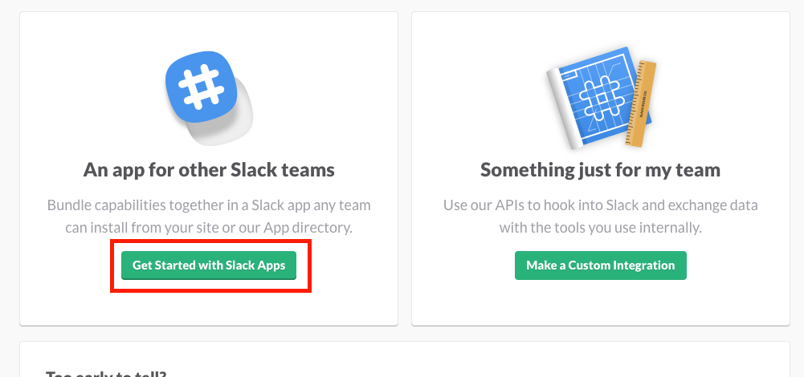

4\. This page will provide us with a brief intro of what a Slack app is and how it works. We want to create an app, so click on **Create an app** on the left side of the article:

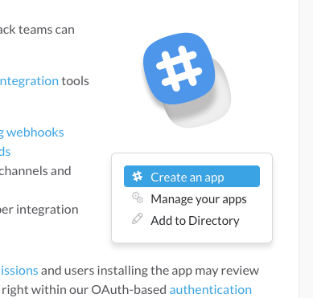

5\. This should open a dialog box where you can provide a name for your Slack App distinctive to your Chatbot (e.g. WildRydes Chatbot), select your current team in Development Slack Team and do **NOT** ticket the "I plan to subit this app to the Slack App Directory" checkbox. Now click on **Create App**.

6\. We now have created our first Slack app. The workshop code itself relies on AWS Lambda Environment variables to store the Client ID and Client Secret that Slack just created for us. We need to provide these information to our AWS Lambda function before proceeding. Click on **Show** under **App Credentials->Client Secret**.

7\. Open a new tab and navigate to the **AWS Management Console** and select your **AWS Lambda** service. Select the **chatbot-SlackApp-\<Random ID\>** function. Scroll down to see the **Environment variables**. Now go ahead and fill in the `SLACK_CLIENT_ID` and `SLACK_CLIENT_SECRET` variables with the respective values that you see in the Slack App tab. Now scroll up and hit the **Save** button.

8\. The next step is to tell Slack how to connect to our AWS Lambda backend. First on the list is authentication. Go back to your Slack browser tab and click on **OAuth & Permissions** in the left navigation bar.

9\. In order for someone to install the Slack App into their channel, we must provide an OAuth mechanism through our app, to allow our AWS Lambda function access to the Slack channel in which the app is installed. To do so, we need to indicated Slack where to find our OAuth endpoint. Enter your API Gateway URL to the `slack-app` webhook and append the "action" parameter with the value **oauth** into the **Redirect URL(s)** textbox. A sample URL would be  `https://<domain-id>.execute-api.<your-region>.amazonaws.com/Prod/slack-app?action=oauth`. Now hit the **Save Changes** button.

10\. Next we need to setup the webhook to our AWS Lambda functions that responds to [interactive messages](https://api.slack.com/docs/message-buttons) in our Slack channel. We will use this later to approve or reject automated answers by our chatbot, if the knowledge base search has resulted in low accuracy matches. Click on **Interactive Messages** in the left hand navigation.

11\. On the next page click on **Enable Interactive Messages**, enter your API Gateway URL to the `slack-app` webhook and append the "action" parameter with the value **interactive_message** into the **Request URL** textbox. A sample URL would be  `https://<domain-id>.execute-api.<your-region>.amazonaws.com/Prod/slack-app?action=interactive_message`. Now click again on the **Enable Interactive Messages** button.

12\. Lastly we also want to provide the functionality to query our Chatbot app for information, straight from a Slack channel using [Slash Commands](https://api.slack.com/slash-commands). Click on **Slash Commands** in the left hand menu.

13\. Click on **Create New Command**. We will add two commands, one `/helloworld` and one `/lastmessages`, feel free to extend this to your own channel commands later. Enter **/helloworld** into the **Command** field. For **Request URL** enter your API Gateway URL to the `slack-app` webhook and append the "action" parameter with the value **helloworld**. A sample URL would be  `https://<domain-id>.execute-api.<your-region>.amazonaws.com/Prod/slack-app?action=helloworld`. Enter a meaningful **Short Description** such as "This command will send a friendly Hello back" and leave **Usage Hint** empty. Now click the **Save** button.

14\. Repeat this for the `/lastmessages` channel command and for **Request URL** enter your API Gateway URL to the `slack-app` webhook and append the "action" parameter with the value **last_messages**. A sample URL would be  `https://<domain-id>.execute-api.<your-region>.amazonaws.com/Prod/slack-app?action=last_messages`.

15\. We now have a fully function Slack App, but we haven't associated it with any channel yet. To install this app into a channel, we need to use our OAuth mechanism to allow our AWS Lambda function to communicate with a Slack channel. The easiest way to do so, is by using a [Slack Button](https://api.slack.com/docs/slack-button). Navigate to the [Slack Button](https://api.slack.com/docs/slack-button) and scroll down until you see the **Add to Slack** button:

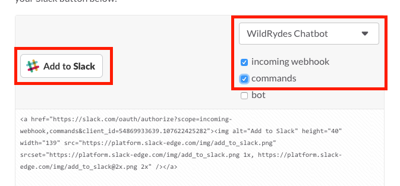

16\. Make sure to select your newly created app (e.g. WildRydes Chatbot) and tick the **incoming webhook** and **commands** checkboxes. Now click on  **Add to Slack**.

17\. The next dialog will present the user clicking on this button (which could be anyone trying to use your new Chatbot Slack App) with the usual OAuth dialog that confirms the access permission of our app to the Slack channel:

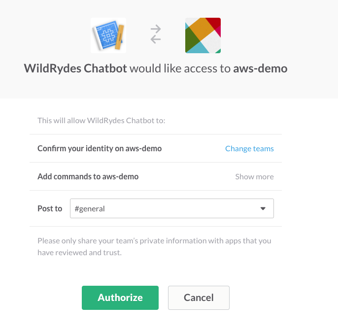

18\. Verify that you're using the correct Slack team (the one you created for this workshop) and select for **Post to** the channel in which you would like to install your Slack app. We suggest to use `#general` here, but any channel could be used (e.g. `#facebook-messenger-operations`). Now click **Authorize**.

19\. We should now be redirected to the channel we installed this app, and it should provide us with a message that our WildRydes chatbot integration has been added to the channel.

20\. For simplicity of this workshop code, we have not created a functionality to associate a Facebook page with a specific Slack channel. As such we need to tell our AWS Lambda function what "default" channel we should post to. As part of enabling this Slack app, Slack has send our AWS Lambda function a few information about the channel it has enabled, which the function has stored in a DynamoDB table. Open another tab and navigate to your **AWS Management Console** and select **Amazon DynamoDB**. Navigate to the **Tables** and select the **slack-app-channels** table. In the right tab, click on **Items**. This will list all the channel information in which our Slack app has been installed, including their secret Configuration and Incoming Webhook URL. Anyone who has this URL, could post information to your Slack Channel, so it's important to not share this URL outside our DynamoDB table. Select and copy the **channel_id** of the channel in which you've just enabled the Slack App. (It's a short alphanumerical string that looks like this `C1LQ4MAEP`)

21\. Navigate to your **AWS Management Console** and select your **AWS Lambda** service. Select the **chatbot-SlackApp-\<Random ID\>** function. Scroll down to see the **Environment variables**. Now go ahead and fill in the `SLACK_CHANNEL_ID` with the **channel_id** you copied earlier from your DynamoDB table. Lastly we also need to tell our Slack Lambda function, which Facebook page to operate on. Change the `FACEBOOK_PAGE_ID` to your Facebook page ID. Now hit the **Save** button.

_If you don't have the Facebook page ID handy, navigate to your Facebook page, click on **About** and scroll down to the bottom to see Facebook Page ID_


###### Section 2 Complete!

Congratulations! You have created your first Slack App with Amazon API Gateway and AWS Lambda! Let's try it out by going to your Slack App enabled channel and type `/helloworld`. You should now get a friendly hello back. You can also try the `/lastmessages` channel command and you should see the previous messages you sent via Facebook.


* * *

## Section 3 - Knowledge Base

**What you'll do in this section...**

In this lab you'll launch an Elasticsearch Service cluster to index our knowledge base and the message communication including the sentiment analysis results.

**Knowledge Base Architecture**


This section will be rather short, since you already setup the ElasticSearch cluster earlier as part of the workshop setup.

1\. Navigate to your **AWS Management Console** and select your **Amazon Elasticsearch Service** and click on the **chatbot** domain. You should now have a cluster where the **Domain status** is Active. (Note: If your Cluster health indicates a "Yellow" status, you can still proceed, since Yellow status is set when only one node in the cluster is available.)

2\. Click on the Endpoint URL to see if your search domain is ready. It should return you a JSON string. Now go ahead and copy the Endpoint URL into your clipboard.

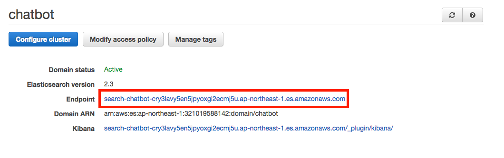

3\. Our Chatbot AWS Lambda function will use the Elasticsearch endpoint to query the knowledgebase and index incoming messages. As such we need to provide the endpoint URL as environment variable to the Lambda function. Navigate to your **AWS Management Console** and select your **AWS Lambda** service. Select the **chatbot-FBMessageEvent-\<Random ID\>** function. Scroll down to see the **Environment variables**. Now go ahead and fill in the `ES_ENDPOINT` with the Elasticsearch endpoint URL you just copied earlier and scroll back up to hit the **Save** button. (Note: The URL must contains the protocol and trailing slash. So make sure to include https:// in the front and / at the back, an example URL would be: `https://search-chatbot-<ID>.<your-region>.es.amazonaws.com/`)

4\. Repeat the same environment variable setting of `ES_ENDPOINT` with the **chatbot-KnowledgeBase-\<Random ID\>** AWS Lambda function.

5\. The **chatbot-KnowledgeBase-\<Random ID\>** Lambda function will help us to populate our Elasticsearch Knowledge Base with most commonly asked questions and answers. Our chatbot will later use this to find the most appropriate answer to a question. To simplify the load process, we included the entire current knowledge base into a JSON object in the Lambda function. For production environments we would suggest to write AWS Lambda functions that could be used to easily add, remove or update items in the knowledge base, rather then always performing a full load. Now go ahead and hit the **Test** button for the `chatbot-KnowledgeBase-<Random ID>` function (You don't need to provide any input parameters, so just submit it with an empty `{}` test event). Scroll down and look at the execution result, it should now show "Knowledge Base loaded successfully":

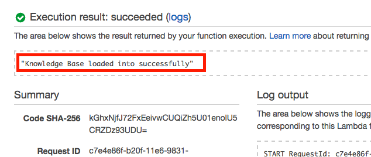

6\. (Optional) If you inspect the code of the knowledge-base Lambda function, you will notice that we loaded all these items into an Elasticsearch Index called `/knowledgebase` with a document called `/qa` that will contain "question" and "answer" fields. If you wonder why "question" entries might look weird, those are the NLTK stemmed keywords to which this answer might relate to. If you want to build your own items we suggest to use "Snowball" stemmed keywords. There's a great [Online Demo](http://text-processing.com/demo/) available for NLTK where you can scroll down to "Stem Text" and choose the "Snowball Stemmers->English".


###### Section 3 Complete!

Alright, we got our Elasticsearch index setup and loaded in our knowledgebase. Let's try to retrieve some answers from our Elasticsearch domain, to see if everything has been loaded up correctly. Since our access policy for our Elasticsearch domain allows world-readable access, try to query the index from your browser (or curl) by issuing a GET request as follows:

`https://search-chatbot-<ID>.<your-region>.es.amazonaws.com/knowledgebase/_search?q=question:hello`

and your output should be a JSON object that looks like this:

```json
{
  "took" : 3,
  "timed_out" : false,
  "_shards" : {
    "total" : 5,
    "successful" : 5,
    "failed" : 0
  },
  "hits" : {
    "total" : 1,
    "max_score" : 0.8465736,
    "hits" : [ {
      "_index" : "knowledgebase",
      "_type" : "qa",
      "_id" : "982aad715601a4f9cda1414dd76a2c2c",
      "_score" : 0.8465736,
      "_source" : {
        "question" : "hello hi hey howdy",
        "answer" : "Hey there, I'm an automated Chatbot of WildRydes, how can I help you today?"
      }
    } ]
  }
}
```


* * *

## Section 4 - Language Processing Lambda Function

**What you'll do in this section...**

Time to bring our Chatbot alive and connect all the pieces together of what we've build so far. This section will help us build a complete event-driven architecture with AWS Lambda and DynamoDB. First you will use a DynamoDB stream to attach an AWS Lambda function to the incoming **facebook-messages** DynamoDB table. This AWS Lambda function will query the knowledge base to find answers, respond to the user and also analyze the sentiment of the incoming messages with the help of other AWS Lambda functions that use the [Natural Language Toolkit (NLTK)](http://www.nltk.org/) to perform a sentiment analysis and improve the knowledge base search query against our Amazon Elasticsearch Knowledge Base.

If an answer from the knowledge base has a low match score (meaning the answer is probably not useful nor related to the customer's query), the AWS Lambda function will send the proposed answer to our Slack channel for manual approval. If the message has been approved or rejected the **chatbot-SlackApp-\<Random ID\>** Lambda function will update our **facebook-messages** DynamoDB table. This will trigger the DynamoDB stream, call our **chatbot-FBMessageEvent-\<Random ID\>** Lambda function and send the appropriate answer to the Facebook user.

**Language Processing Lambda Function Architecture**


1\. Navigate to your **AWS Management Console** and select **AWS Lambda** and open the **chatbot-FBMessageEvent-\<Random ID\>** AWS Lambda function. In the tabs click on **Triggers**.

2\. The idea is to attach this AWS Lambda function to our **facebook-messages** DynamoDB table to process any change (add, delete, update) on the incoming messages. Click on **Add trigger**

3\. This will open an Add trigger dialog. Click into the dashed grey square next to the AWS Lambda icon and select **DynamoDB**. Now choose **facebook-messages** as **DynamoDB table**. The **Batch size** will indicate how many new messages must be in the DynamoDB stream, before our AWS Lambda function is called. Since we want to execute this function as quickly as possible set this value to **1**. (_Note: In production environments with heavy message traffic this could be adjusted to reduce AWS Lambda calls_). Lastly select **Trim horizon** as **Starting position**, which will make sure to always work on the incoming messages in a chronological manner and work them off one by one. Ensure that the **Enable trigger** checkbox is ticked and then hit **Submit**.

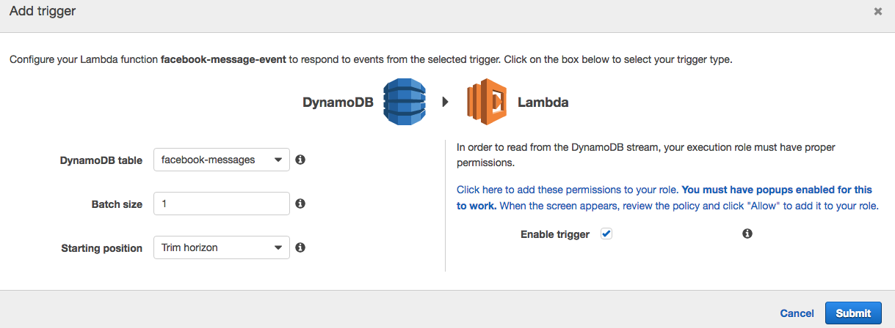

4\. The DynamoDB stream will now immediately be activated and will start to work on all incoming messages from now on, which will bring our chatbot alive! No further actions are required, since the **chatbot-FBMessageEvent-\<Random ID\>** AWS Lambda function code contains all the necessary logic to take message input from the DynamoDB table, send it to the **chatbot-NLP-\<Random ID\>** AWS Lambda function to stem the incoming query, send it to Elasticsearch to find answers, interact with the Facebook Graph API to respond or use the **chatbot-SlackApp-\<Random ID\>** AWS Lambda function to send the question for manual approval, and lastly use the **chatbot-SentimentAnalysis-\<Random ID\>** AWS Lambda function to determine the sentiment and index it into Elasticsearch.

_Note: We encourage you to have a look at the **chatbot-FBMessageEvent-\<Random ID\>**, **chatbot-NLP-\<Random ID\>** and **chatbot-SentimentAnalysis-\<Random ID\>** AWS Lambda function code to have a better understanding of what's happening under the hood._

###### Section 4 Complete!

Awesome, our Chatbot is ready for some action! Go ahead and open your Facebook Page and launch the Messenger to start chatting with our page. Send a few test messages and you should see how our bot replies:

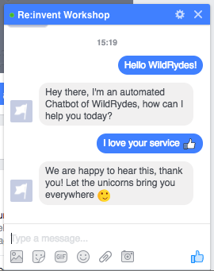

Now we also want to test our manual approval process. The current knowledge base is designed to give a low match rate with complex or extensive sentences which will result in an approval message being sent to our Slack channel. Open your Slack Channel by using your team's URL (e.g. `https://<my-team>.slack.com/messages/general/`)

Open your Facebook Messenger and type a complex sentence, such as for example: `Long sentence that might say hello, but then again doesn't really seem to have much of a question in it!`

Now go back to your Slack channel and you should see that there's an incoming message that needs manual approval. Go ahead and click the **Approve** button, and the chatbot should send the message to your Facebook chat.

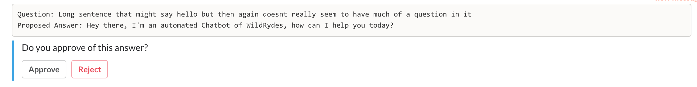

We encourage you to play around with a few messages, approve, reject them and see what happens. The current matching threshold is defined in **chatbot-FBMessageEvent-\<Random ID\>** AWS Lambda function under the **ProcessESResponse** function. Feel free to change the `if (hits.hits[0]["_score"] < 0.02) {` condition to a higher or lower threshold to see what happens.

Lastly we also encourage you to have a look at the **facebook-messages** DynamoDB table and see how it changes based on incoming messages. The `answered` attribute currently supports 5 states: true, false, needs_approval, approved, rejected. Try to change one of these message's `answered` attribute through the DynamoDB console and see what happens:

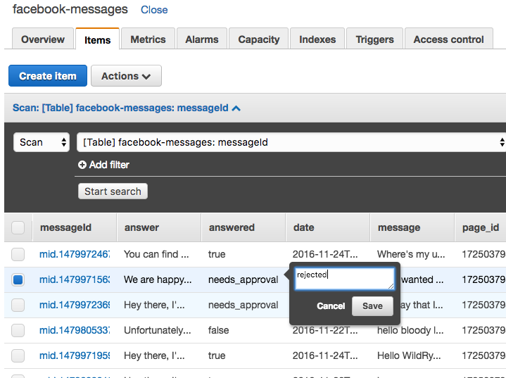


* * *

## Section 5 - Real-Time Dashboard (Sentiment Analysis)

**What you'll do in this section...**

In this section you will use Kibana together with the previously created Elasticsearch search domain to create a real-time dashboard of your customer messages including a sentiment analysis dashboard.

**Real-Time Dashboard Architecture**


1\. Go back to the **AWS Management Console** and click on the **Amazon Elasticsearch Service**. Select the domain of your Chatbot (e.g. chatbot) and navigate to the listed Kibana URL.

2\. Kibana needs to be configured now to use an index pattern for our messages that we logged earlier. Specify **messages** as **Index name** and Kibana should automatically detect "date" as Time-field name. Now click on **Create**.

3\. Next click on Discover on the top left toolbar and see if we have incoming messages. (Tip: The upper right corner contains the time window on which you want to query your index. The default is 15 minutes, but you can change this to a higher value to see all the messages that you sent earlier throughout the workshop)

4\. We now want to create a visualization for all the incoming messages. Click on **Visualize** in the top menu bar.

5\. Click on **Pie chart** to create a pie chart indicating the sentiment of incoming messages, and click on **From a new search** in the second step.

6\. The newly created pie chart will count all the messages we have indexed in the searched time period. We now want to slice up the pie chart to create three categories for our sentiment analysis dashboard: Bad, Neutral and Positive. To do so click on **Split Slices** on the left panel under buckets.

7\. Click on Aggregation and select **Range** and select "sentiment" as **Field** value. Now create 3 ranges, one from -1 to -0.10 (bad sentiment), one from -0.10 to 0.10 (neutral sentiment) and one from 0.10 to 1 (positive sentiment). After creating the ranges, click the "Play" button on the top of the left legend.

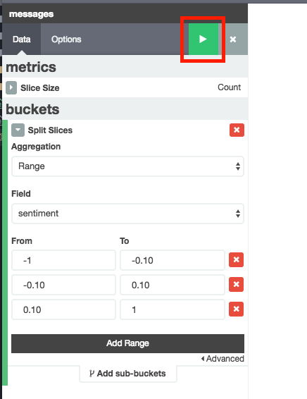

8\. You now created a clear visualization to identify the overall sentiment of incoming messages. The bad sentiment range should obviously be kept low and by having a live dashboard it allows our operational team to step in as soon as necessary. Let's save this visualization for our dashboard by clicking the disk icon in the top right corner and providing a meaningful name (e.g. Overall Sentiment Analysis):

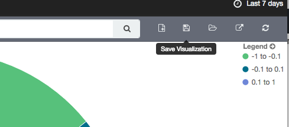

9\. This pie chart visualization unfortunately doesn't provide us with a great view over how sentiment changes over time. As such, let's create another visualization that maps out overall message activity including sentiments over the selected period of time. Click again on the **Visualize** link in the top menu.

10\. Click **Area Chart** and select **From a new search** as search source.

11\. In the next screen we need to split up the buckets of the area chart and select the X-Axis. Since we want a visualization of messages (Y-Axis Count) over a period of time, let's select time as factor for the X-Axis. Click on **X-Axis** as bucket type on the left legend and select **Date Histogram** as Aggregation type. The default should select **date** as Field and **Auto** as Interval (Auto will automatically adjust the date range values to create a balanced view based on window size). Now click the "Play" button again in the top left legend, you should now see incoming messages over time.

12\. Let's try to add further visualization of sentiment into this chart to detect sudden bad sentiment spikes. On the left legend click on **Add sub-buckets**.

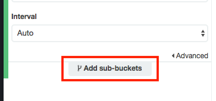

13\. Select **Split Area** and select **Range** as Sub Aggregation type. Select **sentiment** as Field and create again the sentiment rages as previously: [-1 to -0.10],[-0.10 to 0.10] and [0.10 to 1] and click the "Play" button. You should now have a visualization of incoming messages including sentiment over a period of time. Hit the save button and give this visualization a meaningful name (e.g. Message Traffic)

14\. Feel free to create other visualizations with the newly learned Kibana tool. Our next step after that will be to create a dashboard, for this click **Dashboard** in the top menu.

15\. To create a dashboard, we need to load in previously created visualizations. Click the **(+)** Plus button on the top right corner:

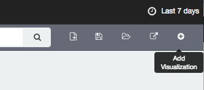

16\. Select the previously created visualizations (such as Message Traffic and Overall Sentiment Analysis) and see them appear in the dashboard below. You can now hover your mouse on the corner of the visualization to scale them and drag them around to create your own personalized dashboard:

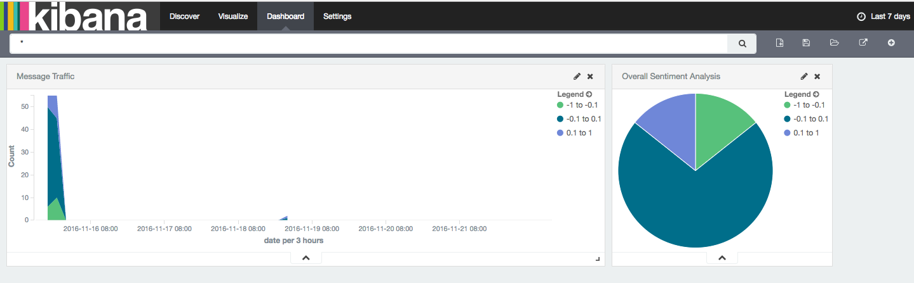

17\. When you're happy with your dashboard, click again on the top right disk icon to save the dashboard and give it a meaningful name (e.g. WildRydes Messaging Dashboard)

18\. The last step to get a real-time dashboard, is to set the refresh interval in Kibana. Click on the top right corner in Kibana where you see a watch icon, and then click on **Auto-refresh**

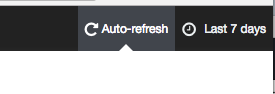

19\. Select an update interval for your dashboard, we suggest to select **5 seconds** et voilà you got your first Real-Time Sentiment Analysis dashboard of incoming Facebook messages!

###### Section 5 Complete!

You completed the last part of this workshop and now got a fully functional AWS Lambda powered Chatbot and real-time dashboard displaying your WildRydes customer's sentiments! Time to sit back, relax and have your bot answer WildRyde's incoming customer messages. Well done!


* * *

## Cleanup

At the end of this workshop you might want to cleanup all the resources you created. Since we used a CloudFormation template this process will be rather easy:

* Go to your **CloudFormation Console**, select the **chatbot** stack, click on **Actions** and select **Delete Stack**. This will automatically remove all resources that have been previously created.
* Navigate to your **Elasticsearch Service Console**, select the **chatbot** search domain, scroll down and click on **Delete Elasticsearch domain** and confirm by clicking **Delete domain**
* Navigate to Facebook and Slack respectively and delete your apps
